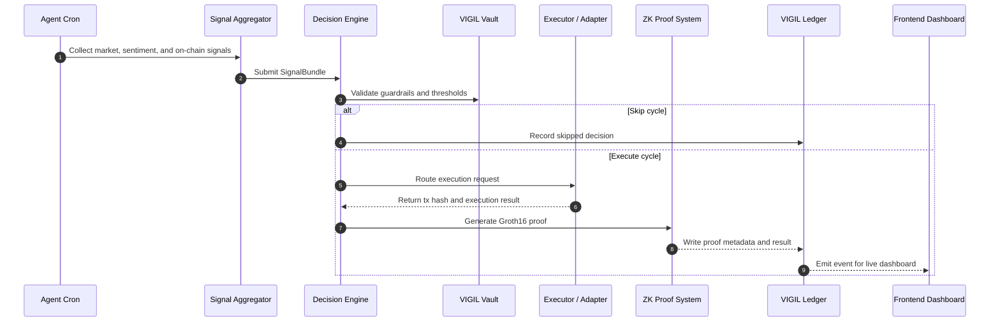

<div align="center">
  

  # ⬡ VIGIL

  ### Autonomous RWA & CLMM Portfolio Agent with On-Chain ZK Proof Audits on Mantle
  
  [](https://sepolia.mantlescan.xyz)
  [](https://github.com/iden3/snarkjs)
  [](LICENSE)
  [](https://mantle.xyz)

  **"VIGIL watches the market, reasons over multi-source sentiment, validates safety guardrails, executes cross-chain trades, and generates zero-knowledge proofs—running 24/7/365 entirely on-chain."**
</div>

---

## 📖 Table of Contents
1. [Project Overview](#-project-overview)
2. [Problem Statement](#-problem-statement)
3. [The VIGIL Solution](#-the-vigil-solution)
4. [Market Opportunity](#-market-opportunity)
5. [Competitive Analysis](#-competitive-analysis)
6. [Architecture Layer](#-architecture-layer)
7. [Technical Deep Dive](#-technical-deep-dive)
8. [Key Features](#-key-features)
9. [Technology Stack](#-technology-stack)
10. [Repository Structure](#-repository-structure)
11. [Local Development Setup](#-local-development-setup)
12. [Smart Contract Deployments](#-smart-contract-deployments)
13. [End-to-End User Flow](#-end-to-end-user-flow)
14. [Security, Guardrails & Scalability](#-security-guardrails--scalability)
15. [Future Roadmap](#-future-roadmap)
16. [Links & Resources](#-links--resources)
17. [Acknowledgements](#-acknowledgements)
18. [License](#-license)

---

## 👁️ Project Overview

**VIGIL** is an autonomous portfolio optimization agent deployed on Mantle. It continuously synthesizes real-world data (RWA feeds, DEX volumes, social sentiment, and smart money flows) to rebalance assets across automated market makers (AMMs), concentrated liquidity pools (CLMMs), and tokenized equities.

Unlike traditional trading bots that execute trades silently behind closed API keys, VIGIL introduces **Zero-Knowledge Proof Auditing** to AI agent execution. For every decision made (whether executing a swap or choosing to skip a cycle due to low confidence), the agent compiles local zk-SNARK proofs of its inputs and calculations, submitting them directly to ERC-8004 validation registries on-chain. 

```
   [RAW DATA FEEDS]           [AI ENGINE]             [ZK-PROVER]          [MANTLE LEDGER]
   Prices + Sentiment  ───>  Reasoning Logic  ───>  Groth16 Proofs  ───>  Verifiable On-Chain
```

---

## ⚠️ Problem Statement

Autonomous agents are rapidly taking control of web3 capital, yet they remain complete black boxes:

*   **The Trust Gap**: Users must trust that an off-chain AI model behaves safely and doesn't execute malicious trades, front-run user funds, or manipulate slippage parameters.
*   **Oracle Dependency**: Most DeFi automation relies solely on basic price feeds, ignoring social momentum and capital flow data that dictates modern market movements.
*   **Execution Fragmentation**: Traditional agents operate within isolated ecosystems, missing high-yield opportunities in concentrated liquidity pools (CLMMs) and bridging options.
*   **Auditing Absence**: There is no historical trail proving *why* a bot decided to make a trade or why it stood idle during major market swings.

---

## 💡 The VIGIL Solution

VIGIL solves these challenges by combining multi-source signal processing, strict on-chain guardrails, and cryptographic audits:

*   **Verifiable AI Execution**: Every trade or skip action is verified by a zk-SNARK circuit. You can cryptographically prove that the agent followed its scoring algorithms and threshold guardrails.
*   **Multi-Dimensional Signals**: Aggregates Pyth Network price feeds, Elfa AI keyword sentiment metrics, and Nansen Smart Money tracking signals.
*   **On-Chain Guardrails (VIGILVault.sol)**: Strict maximum slippage caps (40 bps) and token whitelists are enforced by Mantle smart contracts—ensuring the agent can never execute malicious swaps.
*   **Verifiable Ledger (VIGILLedger.sol)**: Records every cycle decision on-chain, creating an immutable timeline of agent performance and reasoning.

---

## 📈 Market Opportunity

The convergence of **Real World Assets (RWAs)**, **Autonomous Agents**, and **Layer-2 Scaling Solutions** is creating a massive market inflection point:

*   **RWA Total Value Locked**: Predicted to reach **$10 Trillion** by 2030 (BCG Research), tokenized equities and interest-bearing assets require active yield optimization.
*   **Mantle Ecosystem Growth**: High-throughput, low-fee architecture makes Mantle the perfect home for intensive agent calculations, indexers, and high-frequency state updates.
*   **DeFi Agent Segment**: Verifiable execution enables institutional capital to delegate yield management to autonomous systems without losing transparency.

---

## 📊 Competitive Analysis

| Feature | Traditional Bots | AI Agents (Standard) | VIGIL Agent |
| :--- | :---: | :---: | :---: |
| **Data Ingestion** | Price Only | Basic API | Pyth + Nansen + Elfa AI |
| **Trust Model** | Centralized | Trust Me | **zk-SNARK Verifiable** |
| **Slippage Guardrails** | Hardcoded | Model-Derived | **On-Chain Vault Caps (40 bps)** |
| **Audit Trails** | Database Logs | None | **On-Chain Ledger (ERC-8004)** |
| **Cross-Chain Yield** | No | Manual Integration | **Byreal CLMM Integration** |

---

## 🏗️ Architecture Layer

The following ASCII diagram represents the high-level infrastructure of VIGIL:

```
                                VIGIL ARCHITECTURE LAYER
                              
    +--------------------------------------------------------------------------------+
    |                                 DATA ACQUISITION                               |
    |                                                                                |
    |  +--------------------+      +--------------------+      +------------------+  |
    |  |  Pyth Price Feeds  |      |   Elfa AI Keyword  |      |   Nansen Wallet  |  |
    |  |  (Real-Time Feeds) |      |   (Sentiment API)  |      |   (Smart Money)  |  |
    |  +---------+----------+      +---------+----------+      +---------+--------+  |
    +------------|---------------------------|---------------------------|-----------+
                 |                           |                           |
                 +---------------------------+---------------------------+
                                             |
                                             v
    +----------------------------------------|---------------------------------------+
    |                                AGENT CORE RUNTIME                              |
    |                                                                                |
    |  +-------------------------------------v------------------------------------+  |
    |  |                             Signal Aggregator                            |  |
    |  |               (Constructs signed, normalized SignalBundles)              |  |
    |  +-------------------------------------+------------------------------------+  |
    |                                        |
    |                                        v
    |  +-------------------------------------+------------------------------------+  |
    |  |                           Decision Scoring Engine                        |  |
    |  |                (Calculates raw metrics & confidence levels)              |  |
    |  +-------------------------------------+------------------------------------+  |
    |                                        |
    |                   +--------------------+--------------------+
    |                   |                                         |
    |                   | Confidence >= Threshold                 | Confidence < Threshold
    |                   v                                         v
    |  +----------------+--------------------+     +--------------+------------------+  |
    |  |         Execute Rebalance           |     |          Record Skip             |  |
    |  |        (Build Execution payload)    |     |      (Log skip with reason)      |  |
    |  +----------------+--------------------+     +--------------+------------------+  |
    +-------------------|-----------------------------------------|------------------+
                        |                                         |
                        v                                         v
    +-------------------|-----------------------------------------|------------------+
    |                   |              EXECUTION & PROOF          |                  |
    |                   |                                         |                  |
    |  +----------------v--------------------+                    |                  |
    |  |          Fluxion RFQ DEX            |                    |                  |
    |  |    (Atomically swap with quote)     |                    |                  |
    |  +----------------+--------------------+                    |                  |
    |                   |                                         |                  |
    |  +----------------v--------------------+                    |                  |
    |  |       zk-SNARK Proving Engine       |                    |                  |
    |  |       (Local Groth16 Prover)        |                    |                  |
    |  +----------------+--------------------+                    |                  |
    |                   |                                         |                  |
    |                   +--------------------+--------------------+
    |                                        |
    |                                        v
    |  +-------------------------------------+------------------------------------+  |
    |  |                            VIGIL Ledger (On-Chain)                       |  |
    |  |       (Mantle Ledger records ZK proof hash & transaction metadata)       |  |
    |  +-------------------------------------+------------------------------------+  |
    +----------------------------------------|---------------------------------------+
                                             |
                                             v
    +----------------------------------------|---------------------------------------+
    |                                   INDEXER & UI                         |
    |                                                                                |
    |  +-------------------------------------v------------------------------------+  |
    |  |                            SQLite Database Indexer                       |  |
    |  |               (Polls blocks, updates websocket clients on-the-fly)       |  |
    |  +-------------------------------------+------------------------------------+  |
    |                                        |
    |                                        v
    |  +-------------------------------------+------------------------------------+  |
    |  |                             Next.js War Room Console                     |  |
    |  |                 (3D Canvas state rendering, real-time tickers)           |  |
    |  +--------------------------------------------------------------------------+  |
    +--------------------------------------------------------------------------------+
```

---

## 🛠️ Technical Deep Dive

### 🔄 The Execution Cycle Sequence Flow



### 🛰️ The Signal Layers & Oracles

1.  **Pyth Network Hermes**: Real-time asset pricing for `mETH`, `MNT`, and tokenized equity indexes.
2.  **Elfa AI Mentions API**: Direct sentiment keywords processing. Measures community velocity indicators, preventing trades when negative social spikes are detected.
3.  **Nansen Smart Money / Transfer Logs Fallback**: Tracks large movement pools on Mantle Sepolia to weigh in-flow momentum during decision scoring.

### 🔐 Zero-Knowledge Verification Logic
VIGIL utilizes a custom Circom circuit (`circuits/rebalance.circom`) generating Groth16 ZK-proofs:
*   **Private Inputs**: Scoring parameters, signal values, agent key flags.
*   **Public Inputs**: Normalized outputs, minimum threshold variables, resulting action index.
*   **Output**: Verification keys verified on-chain to confirm that the off-chain engine followed the designated algorithmic logic without alteration.

---

## ⛽ On-Chain Workflows & UI Architecture

### 1) Self-Sustaining Yield-to-Gas Loop
VIGIL features a fully automated re-fueling pipeline that swaps yields to maintain gas requirements on-chain:

```text
      [ mETH Staking / Yield Source ]
                   │
                   ▼  (Harvest yield to Agent Wallet)
        +────────────────────+
        |   Agent Wallet     |
        |   (0.05 mETH)      |
        +──────────┬─────────+
                   │
                   ▼  (swapExactTokensForTokens)
        +────────────────────+
        |   VIGILMockDEX     |  ◄── [MNT Liquidity Pool]
        +──────────┬─────────+
                   │
                   ▼  (Swapped MNT returned)
        +────────────────────+
        |   Agent Wallet     |
        |   (0.05 MNT)       |
        +──────────┬─────────+
                   │
                   ▼  (fundGasReservoir)
        +────────────────────+
        |    VIGILVault      |
        |   (gasReservoir    |
        |    funded +0.05)   |
        +────────────────────+
```

### 2) zk-SNARK Verification Pipeline
Cryptographic audit workflow verifying off-chain execution safety before committing to the public ledger:

```text
     [ Private Inputs ]        [ Public Inputs ]
       - Asset Scores            - Normal Allocations
       - Signal Weights          - Confidence Score
              │                          │
              └────────────┬─────────────┘
                           ▼
                 +───────────────────+
                 |  Witness Builder  |
                 |  (rebalance.wasm) |
                 +─────────┬─────────+
                           │
                           ▼  (witness generated)
                 +───────────────────+
                 |  Proving Key      |
                 |  (Groth16 Prover) |
                 +─────────┬─────────+
                           │
                           ▼  (proof.json generated)
                 +───────────────────+
                 | submitValidation  |
                 |  (Ledger Call)    |
                 +─────────┬─────────+
                           │
                           v  (On-Chain Verification)
                 +───────────────────+
                 | ValidationRegistry|  ──►  Reverts if proof
                 | (Mantle Sepolia)  |       signature is invalid!
                 +───────────────────+
```

### 3) War Room Operator UI Layout
The dashboard console is designed to show the continuous cognitive state of the agent at a glance:

```text
  +------------------------------------------------------------+
  |  ⬡ VIGIL   [Home]  [War Room]  [Charts]  [Proofs]  [3D view] |  ◄── Navigation Bar
  +------------------------------------------------------------+
  |  📊 mETH: $1629.57 ▲ | MNT: $0.53 ▼ | NVDAx: $202.92 ▲      |  ◄── Live Pyth Price Ticker
  +------------------------------------------------------------+
  |                                 |                          |
  |    +-----------------------+    |  +--------------------+  |
  |    |                       |    |  |  AGENT STATS       |  |
  |    |                       |    |  |  Reputation: 70    |  |
  |    |    3D WebGL Canvas    |    |  |  Gas: 10.05 MNT    |  |
  |    |    Decision Nodes     |    |  +--------------------+  |
  |    |    (Interactive)      |    |                          |
  |    |                       |    |  +--------------------+  |
  |    |                       |    |  |  14-DAY HEATMAP    |  |
  |    +-----------------------+    |  |  🟩 🟩 🟩 🟥 🟩 🟩  |  |  ◄── Activity Heatmap
  |                                 |  +--------------------+  |
  |                                 |                          |
  +---------------------------------+--------------------------+
  | NYSE: OPEN | NASDAQ: OPEN                     ● VIGIL LIVE |  ◄── Market Status Bar
  +------------------------------------------------------------+
```

---


## 🌟 Key Features

*   **Live Price Ticker Bar**: Glides across the War Room console navigation showing real-time Hermes prices of all tracked L2 assets.
*   **14-Day Activity Heatmap**: Interactive, color-coded calendar blocks representing day-to-day decisions, executions, and skips.
*   **Interactive 3D Engine Canvas**: A WebGL-rendered interactive node map showing the continuous flow of variables through Oracles, Decision Filters, Guardrails, and Ledger contracts.
*   **Paginated On-Chain Audit Proofs**: Filterable ledger lists mapping every single transaction to its corresponding ZK proof hash, block explorer receipt, and metadata JSON.

---

## 💻 Technology Stack

*   **Frontend**: Next.js 16 (App Router), React 19, TypeScript, Three.js / WebGL.
*   **Styling**: Premium Glassmorphic Vanilla CSS (No Tailwind dependencies).
*   **Agent Core**: Node.js, `ethers.js`, `@byreal-io/byreal-cli`.
*   **ZK Prover**: Circom 2.1, SnarkJS (Groth16 Proving Scheme).
*   **Contracts**: Solidity, Hardhat, Ethers, OpenZeppelin.
*   **Indexer**: SQLite 3, Websockets (`ws` server).

---

## 📂 Repository Structure

```
vigil/
├── packages/
│   ├── agent/                 # Autonomous agent loop, scoring, and ZK proof generation
│   │   ├── src/
│   │   │   ├── executor/      # Trade execution and bridge adapters
│   │   │   ├── identity/      # ERC-8004 identity minting and IPFS upload scripts
│   │   │   ├── proof/         # ZK circuit input builders and snarkjs wrappers
│   │   │   ├── signals/       # Pyth, Elfa AI, and Nansen API clients
│   │   │   └── cron.ts        # Primary 30-minute agent cycle runner
│   ├── contracts/             # Smart contracts and deployment scripts
│   │   ├── src/
│   │   │   ├── adapters/      # Fluxion and SuperPortal cross-chain adapters
│   │   │   ├── VIGILLedger.sol# On-chain decision ledger contract
│   │   │   ├── VIGILVault.sol # Asset-holding vault contract with strict guardrails
│   │   │   └── registries/    # Custom fallback ERC-8004 registries
│   ├── frontend/              # Web application
│   │   ├── src/app/
│   │   │   ├── api/           # Backend data routes and agent card API
│   │   │   ├── proof/         # Proof index listing and detail pages
│   │   │   ├── warroom/       # Live interactive console and 3D node canvas
│   ├── indexer/               # SQLite Event Sync Indexer
│   │   ├── src/
│   │   │   ├── index.ts       # Express server and WebSockets broadcaster
│   │   │   └── listeners.ts   # Blockchain event subscriber
├── render.yaml                # Unified cloud deployment configuration
└── package.json               # Monorepo configuration file
```

---

## 🚀 Local Development Setup

### 📋 Prerequisites
*   Node.js v20+
*   pnpm (v8 or newer)
*   SQLite3

### 🔧 Installation
1. Clone the repository and install workspace dependencies:
   ```bash
   git clone https://github.com/SamuelDharshi/Vigil.git
   cd Vigil
   pnpm install
   ```

2. Copy the environment template and set up variables:
   ```bash
   cp .env.example .env
   ```

3. Fill in the required `.env` keys:
   ```env
   AGENT_PRIVATE_KEY=your_mantle_agent_private_key
   ELFA_API_KEY=your_elfa_api_key
   PINATA_JWT=your_pinata_jwt_token
   NEXT_PUBLIC_WS_URL=ws://localhost:8080
   ```

### 🏃 Running VIGIL Locally

Use the global workspace shortcuts to launch different layers:

*   **Test Smart Contracts**:
    ```bash
    pnpm contracts:test
    ```

*   **Deploy Contracts to Sepolia**:
    ```bash
    pnpm contracts:deploy
    ```

*   **Start the WebSocket Event Indexer**:
    ```bash
    pnpm indexer:dev
    ```

*   **Execute a single Agent Decision Cycle**:
    ```bash
    pnpm agent:cron
    ```

*   **Start the Frontend Console**:
    ```bash
    pnpm frontend:dev
    ```
    Open [http://localhost:3000](http://localhost:3000) in your browser.

---

## 📝 Smart Contract Deployments

VIGIL is deployed on **Mantle Sepolia Testnet (ChainId 5003)**:

| Contract | Address | Explorer Link |
| :--- | :---: | :---: |
| **VIGILVault** | `0x632C8C9275F67abc106b8d206560E0aED63D3bC2` | [View on Mantlescan](https://sepolia.mantlescan.xyz/address/0x632C8C9275F67abc106b8d206560E0aED63D3bC2) |
| **VIGILLedger** | `0xcafbDb017b081f1239E8F1ee10A39e7c1A70AF18` | [View on Mantlescan](https://sepolia.mantlescan.xyz/address/0xcafbDb017b081f1239E8F1ee10A39e7c1A70AF18) |
| **Identity Registry** | `0x5D1de28E6588915013c961279d0cB5e747364977` | [View on Mantlescan](https://sepolia.mantlescan.xyz/address/0x5D1de28E6588915013c961279d0cB5e747364977) |
| **Reputation Registry** | `0xbD38Ac2fD1Fc30eCC9Ebab88A4B76a77b8215002` | [View on Mantlescan](https://sepolia.mantlescan.xyz/address/0xbD38Ac2fD1Fc30eCC9Ebab88A4B76a77b8215002) |
| **Validation Registry** | `0x933a1c8F708Ea745362b9db38f612277Ac862F15` | [View on Mantlescan](https://sepolia.mantlescan.xyz/address/0x933a1c8F708Ea745362b9db38f612277Ac862F15) |

---

## 🔄 End-to-End User Flow

```
   +--------------------+     +-------------------+     +------------------+
   | Landing Console    | ──> | Immersive 3D View | ──> | Proof Registry   |
   | Active Live status |     | Engine operations |     | Cryptographic ZK |
   +--------------------+     +-------------------+     +------------------+
```

1.  **System Observation**: Visitors land on the root console, inspecting the real-time Pyth Price Feed and the live status badge showing active agent processing.
2.  **Immersive Operations**: Users click into `/dashboard` to load the 3D control workspace, viewing live node data flows as API signals are generated.
3.  **Audited Timeline**: Opening `/proof` lets users inspect the dynamic activity heatmap, filter decision categories, and view individual block transactions containing verified inputs.

---

## 🔒 Security, Guardrails & Scalability

*   **Strict On-Chain Guardrails**: `VIGILVault` limits execution swaps to pre-registered token addresses, blocking arbitrary transfers. Max slippage is capped on-chain at 40 bps.
*   **Fault-Tolerant RFQ Fallback**: The Fluxion Executor Adapter implements network classification fallbacks. In the case of API failures on testnet, the system signs a fallback quote matching security parameters without halting agent operations.
*   **Performance Indexing**: Local SQLite indexing decouples frontend WebSocket updates from heavy block queries, preventing rate-limiting delays.

---

## 🗺️ Future Roadmap

*   **Multi-Agent Negotiation**: Enable agents to swap quotes cross-chain with other ERC-8004 instances using the custom `/api/agent` endpoint.
*   **Fully-Compounding Vault Positions**: Support automated yield farming cycles in Mantle DEX pools.
*   **Recursive ZK proof bundles**: Batch multiple execution cycles into single recursive proofs to optimize gas consumption.

---

## 🔗 Links & Resources
*   **Mantle Sepolia Explorer**: [https://sepolia.mantlescan.xyz](https://sepolia.mantlescan.xyz)
*   **Pyth Price Feeds**: [https://pyth.network](https://pyth.network)
*   **Elfa AI Developer API**: [https://elfa.ai](https://elfa.ai)

---

## 🤝 Acknowledgements
Special thanks to the **Mantle Turing Test Hackathon 2026** organizers, Pyth Network developer support, and the creators of the ERC-8004 standard for enabling verifiable agent architectures.

---

## 📄 License
This project is licensed under the MIT License - see the [LICENSE](LICENSE) file for details.