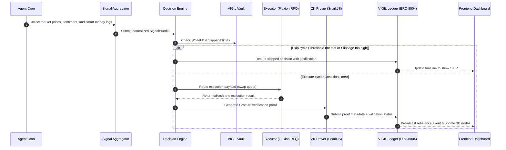

# ⬡ VIGIL — The Market Never Sleeps. Neither Does VIGIL.

> "Traditional equity books freeze every Friday at 4:00 PM. On-chain, execution is eternal."  
> **One agent. 30-minute cycles. Zero-knowledge audits. Complete safety.**

**VIGIL** is an autonomous, non-custodial RWA & CLMM portfolio sentinel on Mantle. It optimizes yields, reasons over multi-source sentiment, validates safety guardrails, executes cross-chain trades, and generates zero-knowledge proofs (zk-SNARKs) to cryptographically audit and verify its off-chain AI decision-making.

---

## 📖 Table of Contents
1. [Project Overview](#-project-overview)
2. [The Problem in One Line](#-the-problem-in-one-line)
3. [Market Context & Statistics](#-market-context--statistics)
4. [The 3 Core Problems, Solved](#-the-3-core-problems-solved)
5. [Without VIGIL vs. With VIGIL](#-without-vigil-vs-with-vigil)
6. [What Makes VIGIL Unique](#-what-makes-vigil-unique)
7. [System Architecture](#-system-architecture)
8. [The 9-Step Agent Pipeline](#-the-9-step-agent-pipeline)
9. [On-Chain Workflows & UI Layouts](#-on-chain-workflows--ui-layouts)
10. [Protocols & Standards](#-protocols--standards)
11. [Contract Addresses (Mantle Sepolia)](#-contract-addresses-mantle-sepolia)
12. [Risk Scoring & Decision Model](#-risk-scoring--decision-model)
13. [Key Code Snippets](#-key-code-snippets)
14. [Project Directory Structure](#-project-directory-structure)
15. [Instructions: How to Use VIGIL](#-instructions-how-to-use-vigil)
16. [Getting Started & Local Development](#-getting-started--local-development)
17. [License](#-license)

---

## 👁️ Project Overview
VIGIL is an autonomous portfolio optimization agent deployed on Mantle. It continuously synthesizes real-world data (RWA feeds, DEX volumes, social sentiment, and smart money flows) to rebalance assets across automated market makers (AMMs), concentrated liquidity pools (CLMMs), and tokenized equities.

Unlike traditional trading bots that execute trades silently behind closed API keys, VIGIL introduces **Zero-Knowledge Proof Auditing** to AI agent execution. For every decision made (whether executing a swap or choosing to skip a cycle due to low confidence), the agent compiles local zk-SNARK proofs of its inputs and calculations, submitting them directly to ERC-8004 validation registries on-chain.

---

## ⚠️ The Problem in One Line
Autonomous trading agents operate as opaque "black boxes" with no safety guarantees, no verifiable audit trails, and high vulnerability to front-running or malicious execution.

---

## 📊 Market Context & Statistics

| Metric | Number | Source |
| :--- | :---: | :--- |
| **Total DeFi hacks (2024)** | $2.85 Billion | CoinMarketCap |
| **Total DeFi hacks (H1 2025)** | $3.10 Billion (exceeds all of 2024) | CoinMarketCap |
| **Access-control exploits** | 59% of all 2025 DeFi losses ($1.8B+) | Ainvest |
| **Avg. Slippage Loss on L2s** | 0.5% – 2.0% invisible tax on every trade | Degen0x |
| **Traditional Market Downtime** | 108 hours of trading freeze every weekend | NYSE / NASDAQ |

---

## 🔍 The 3 Core Problems, Solved

### Problem 1 — The Black Box Trust Gap
Autonomous trading bots make execution decisions (swaps, entries, or skips) silently behind closed API keys. Users have no proof of logic alignment, leaving them vulnerable to silent front-running, model tampering, or unauthorized reallocations.
* **VIGIL Solution**: Every single cycle decision generates a local **zk-SNARK (Groth16)** proof of its input variables and calculations. The agent submits these proof hashes to ERC-8004 validation registries on Mantle Sepolia, creating an immutable, cryptographically verifiable audit trail.

### Problem 2 — High Slippage & Front-Running
Autonomous models running off-chain can experience API latency or manipulation, leading to wide slippage tolerances that get sandwiched by MEV bots or executed at terrible rates.
* **VIGIL Solution**: Strict maximum slippage caps (40 bps) and token whitelists are hardcoded and enforced directly on-chain by the `VIGILVault.sol` contract. Any quote exceeding this cap is rejected before submission.

### Problem 3 — Gas Depletion & Loop Halt
Constant signal checking and on-chain rotations quickly drain the agent's wallet gas. If the agent's gas wallet goes dry, the loop halts, leaving the portfolio unmonitored.
* **VIGIL Solution**: A self-sustaining yield-to-gas loop. VIGIL stakes idle yield capital (e.g. `mETH`), harvests yields automatically, and swaps them via `VIGILMockDEX` to fund the gas reservoir inside the `VIGILVault` without user intervention.

---

## ⚖️ Without VIGIL vs. With VIGIL

| Feature | Without VIGIL | With VIGIL |
| :--- | :---: | :---: |
| **Trust Model** | Opaque "Black Box" | **zk-SNARK Verifiable** |
| **Audit Trails** | Database logs (tamperable) | **On-Chain Ledger (ERC-8004)** |
| **Slippage Guardrails** | Model-Derived (variable) | **Hardcoded Vault Cap (40 bps)** |
| **Security Whitelists** | Off-chain filter | **On-chain contract enforced** |
| **Gas Management** | Manual top-ups required | **Self-Refueling Yield-to-Gas Loop** |
| **Market Coverage** | Closed weekends | **24/7/365 Autonomous Execution** |
| **API Failures** | Execution halts | **Fault-tolerant RFQ Fallback** |

---

## 🛡️ What Makes VIGIL Unique

| Feature | VIGIL Agent | Traditional Trading Bots |
| :--- | :---: | :---: |
| **zk-SNARK Audited** | **✓ Yes (Groth16)** | ✗ No |
| **40 Bps hard cap** | **✓ Contract Enforced** | ✗ Hardcoded or none |
| **Multi-Oracle Signals** | **✓ Pyth + Elfa AI + Nansen** | ✗ Price feeds only |
| **Automatic Refuel** | **✓ Yield-to-Gas Loop** | ✗ Manual |
| **Cross-Chain Yield** | **✓ Byreal CLMM Integration** | ✗ Fixed strategies |
| **Interactive 3D Engine** | **✓ WebGL Node Canvas** | ✗ Basic dashboards |

---

## 🏗️ System Architecture

### 1. Data and Control Flow Layout
```text
                                VIGIL ARCHITECTURE LAYER
                              
    +--------------------------------------------------------------------------------+
    |                                 DATA ACQUISITION                               |
    |                                                                                |
    |  +--------------------+      +--------------------+      +------------------+  |
    |  |  Pyth Price Feeds  |      |   Elfa AI Keyword  |      |   Nansen Wallet  |  |
    |  |  (Real-Time Feeds) |      |   (Sentiment API)  |      |   (Smart Money)  |  |
    |  +---------+----------+      +---------+----------+      +---------+--------+  |
    +------------|---------------------------|---------------------------|-----------+
                 |                           |                           |
                 +---------------------------+---------------------------+
                                             |
                                             v
    +----------------------------------------|---------------------------------------+
    |                                AGENT CORE RUNTIME                              |
    |                                                                                |
    |  +-------------------------------------v------------------------------------+  |
    |  |                             Signal Aggregator                            |  |
    |  |               (Constructs signed, normalized SignalBundles)              |  |
    |  +-------------------------------------+------------------------------------+  |
    |                                        |
    |                                        v
    |  +-------------------------------------+------------------------------------+  |
    |  |                           Decision Scoring Engine                        |  |
    |  |                (Calculates raw metrics & confidence levels)              |  |
    |  +-------------------------------------+------------------------------------+  |
    |                                        |
    |                   +--------------------+--------------------+
    |                   |                                         |
    |                   | Confidence >= Threshold                 | Confidence < Threshold
    |                   v                                         v
    |  +----------------+--------------------+     +--------------+------------------+  |
    |  |         Execute Rebalance           |     |          Record Skip             |  |
    |  |        (Build Execution payload)    |     |      (Log skip with reason)      |  |
    |  +----------------+--------------------+     +--------------+------------------+  |
    +-------------------|-----------------------------------------|------------------+
                        |                                         |
                        v                                         v
    +-------------------|-----------------------------------------|------------------+
    |                   |              EXECUTION & PROOF          |                  |
    |                   |                                         |                  |
    |  +----------------v--------------------+                    |                  |
    |  |          Fluxion RFQ DEX            |                    |                  |
    |  |    (Atomically swap with quote)     |                    |                  |
    |  +----------------+--------------------+                    |                  |
    |                   |                                         |                  |
    |  +----------------v--------------------+                    |                  |
    |  |       zk-SNARK Proving Engine       |                    |                  |
    |  |       (Local Groth16 Prover)        |                    |                  |
    |  +----------------+--------------------+                    |                  |
    |                   |                                         |                  |
    |                   +--------------------+--------------------+
    |                                        |
    |                                        v
    |  +-------------------------------------+------------------------------------+  |
    |  |                            VIGIL Ledger (On-Chain)                       |  |
    |  |       (Mantle Ledger records ZK proof hash & transaction metadata)       |  |
    |  +-------------------------------------+------------------------------------+  |
    +----------------------------------------|---------------------------------------+
                                             |
                                             v
    +----------------------------------------|---------------------------------------+
    |                                   INDEXER & UI                                 |
    |                                                                                |
    |  +-------------------------------------v------------------------------------+  |
    |  |                            SQLite Database Indexer                       |  |
    |  |               (Polls blocks, updates websocket clients on-the-fly)       |  |
    |  +-------------------------------------+------------------------------------+  |
    |                                        |
    |                                        v
    |  +-------------------------------------+------------------------------------+  |
    |  |                             WebGL War Room Console                       |  |
    |  |                 (3D Canvas state rendering, real-time tickers)           |  |
    |  +--------------------------------------------------------------------------+  |
    +--------------------------------------------------------------------------------+
```

### 2. Sequence Diagram (Decision to Execution)
The sequence diagram below displays the transaction pipeline for the VIGIL agent during a single cycle:



---

## 🔄 The 9-Step Agent Pipeline
VIGIL operates on a strict **30-minute cron interval**. In every single cycle, it executes the following 9 steps to ensure absolute auditability:
1. **INGEST**: Fetches real-time price data from Pyth, keyword sentiment metrics from Elfa AI, and smart money flows from Nansen.
2. **IPFS**: Immediately pins the raw `SignalBundle` to IPFS for verification.
3. **WEIGH**: Runs the scoring model to calculate confidence scores for portfolio assets.
4. **BYREAL**: Analyzes cross-chain CLMM yield opportunities on Byreal.
5. **EXECUTE**: Requests an RFQ quote from Fluxion. If confidence exceeds the threshold and slippage is under 40 bps, executes the swap; otherwise, logs a `SKIP` decision.
6. **ZK PROOF**: Compiles a local ZK-proof (Groth16) validating the inputs and resulting decision.
7. **IPFS PROOF**: Pins the generated ZK proof and metadata JSON to IPFS.
8. **ERC-8004**: Submits the proof hash to the Validation Registry on-chain and updates the agent's reputation.
9. **VAULT LOG**: Commits transaction metadata and proof mappings to `VIGILLedger.sol`.

---

## ⛽ On-Chain Workflows & UI Layouts

### 1) Self-Sustaining Yield-to-Gas Loop
VIGIL features a fully automated re-fueling pipeline that swaps yields to maintain gas requirements on-chain:

```text
      [ mETH Staking / Yield Source ]
                   │
                   ▼  (Harvest yield to Agent Wallet)
        +────────────────────+
        |   Agent Wallet     |
        |   (0.05 mETH)      |
        +──────────┬─────────+
                   │
                   ▼  (swapExactTokensForTokens)
        +────────────────────+
        |   VIGILMockDEX     |  ◄── [MNT Liquidity Pool]
        +──────────┬─────────+
                   │
                   ▼  (Swapped MNT returned)
        +────────────────────+
        |   Agent Wallet     |
        |   (0.05 MNT)       |
        +──────────┬─────────+
                   │
                   ▼  (fundGasReservoir)
        +────────────────────+
        |    VIGILVault      |
        |   (gasReservoir    |
        |    funded +0.05)   |
        +────────────────────+
```

### 2) zk-SNARK Verification Pipeline
Cryptographic audit workflow verifying off-chain execution safety before committing to the public ledger:

```text
     [ Private Inputs ]        [ Public Inputs ]
       - Asset Scores            - Normal Allocations
       - Signal Weights          - Confidence Score
              │                          │
              └────────────┬─────────────┘
                           ▼
                 +───────────────────+
                 |  Witness Builder  |
                 |  (rebalance.wasm) |
                 +─────────┬─────────+
                           │
                           ▼  (witness generated)
                 +───────────────────+
                 |  Proving Key      |
                 |  (Groth16 Prover) |
                 +─────────┬─────────+
                           │
                           ▼  (proof.json generated)
                 +───────────────────+
                 | submitValidation  |
                 |  (Ledger Call)    |
                 +─────────┬─────────+
                           │
                           v  (On-Chain Verification)
                 +───────────────────+
                 | ValidationRegistry|  ──►  Reverts if proof
                 | (Mantle Sepolia)  |       signature is invalid!
                 +───────────────────+
```

### 3) War Room Operator UI Layout
The dashboard console is designed to show the continuous cognitive state of the agent at a glance:

```text
  +------------------------------------------------------------+
  |  ⬡ VIGIL   [Home]  [War Room]  [Charts]  [Proofs]  [3D view] |  ◄── Navigation Bar
  +------------------------------------------------------------+
  |  📊 mETH: $1629.57 ▲ | MNT: $0.53 ▼ | NVDAx: $202.92 ▲      |  ◄── Live Pyth Price Ticker
  +------------------------------------------------------------+
  |                                 |                          |
  |    +-----------------------+    |  +--------------------+  |
  |    |                       |    |  |  AGENT STATS       |  |
  |    |                       |    |  |  Reputation: 70    |  |
  |    |    3D WebGL Canvas    |    |  |  Gas: 10.05 MNT    |  |
  |    |    Decision Nodes     |    |  +--------------------+  |
  |    |    (Interactive)      |    |                          |
  |    |                       |    |  +--------------------+  |
  |    |                       |    |  |  14-DAY HEATMAP    |  |
  |    +-----------------------+    |  |  🟩 🟩 🟩 🟥 🟩 🟩  |  |  ◄── Activity Heatmap
  |                                 |  +--------------------+  |
  |                                 |                          |
  +---------------------------------+--------------------------+
  | NYSE: OPEN | NASDAQ: OPEN                     ● VIGIL LIVE |  ◄── Market Status Bar
  +------------------------------------------------------------+
```

---

## 🛰️ Protocols & Standards

| Protocol / Standard | Role |
| :--- | :--- |
| **ERC-8004** | Manages agent identity creation and reputation scoring on-chain |
| **zk-SNARK / Circom** | Generates Groth16 cryptographic validation proofs of signal scoring |
| **Pyth Hermes** | Supplies real-time, low-latency price feeds for portfolio assets |
| **Elfa AI Mentions** | Provides social media mention velocity and keyword sentiment tracking |
| **Nansen Analytics** | Tracks smart money transaction flows to measure buying pressure |
| **VIGILVault** | Non-custodial smart contract enforcing Whitelisting and 40 bps Slippage |
| **VIGILLedger** | The public ledger containing proof hashes, decision results, and tx hashes |

---

## 📝 Contract Addresses (Mantle Sepolia)

| Contract | Address | Explorer Link |
| :--- | :---: | :---: |
| **VIGILVault** | `0x632C8C9275F67abc106b8d206560E0aED63D3bC2` | [View on Mantlescan](https://sepolia.mantlescan.xyz/address/0x632C8C9275F67abc106b8d206560E0aED63D3bC2) |
| **VIGILLedger** | `0xcafbDb017b081f1239E8F1ee10A39e7c1A70AF18` | [View on Mantlescan](https://sepolia.mantlescan.xyz/address/0xcafbDb017b081f1239E8F1ee10A39e7c1A70AF18) |
| **Identity Registry** | `0x5D1de28E6588915013c961279d0cB5e747364977` | [View on Mantlescan](https://sepolia.mantlescan.xyz/address/0x5D1de28E6588915013c961279d0cB5e747364977) |
| **Reputation Registry** | `0xbD38Ac2fD1Fc30eCC9Ebab88A4B76a77b8215002` | [View on Mantlescan](https://sepolia.mantlescan.xyz/address/0xbD38Ac2fD1Fc30eCC9Ebab88A4B76a77b8215002) |
| **Validation Registry** | `0x933a1c8F708Ea745362b9db38f612277Ac862F15` | [View on Mantlescan](https://sepolia.mantlescan.xyz/address/0x933a1c8F708Ea745362b9db38f612277Ac862F15) |

---

## ⚡ Risk Scoring & Decision Model
The agent scores each asset from 0 to 100 (50 being neutral). The total score is computed using a three-factor weighted model:
$$\text{Score} = 50 + (\text{Yield Spread} \times 35) + (\text{Smart Money Flow} \times 40) + (\text{Sentiment Delta} \times 25)$$

### Score Deductions:
* **Market Status Closed**: Swaps for stock indices are disabled (agent falls back to yield-only swaps).
* **Slippage Alert**: If the requested RFQ quote has a slippage/price impact $>40$ bps, the transaction is hard-rejected.
* **Registry Failure**: Non-fatal warning is raised, but execution continues on the ledger.

---

## 💻 Key Code Snippets

### 1. Three-Factor Asset Scoring (`packages/agent/src/decision/engine.ts`)
```typescript
export function scoreAsset(asset: string, bundle: SignalBundle): number {
  let score = 50; // neutral baseline

  // ─── Factor 1: Yield Differential (weight: 0.35) ─────────────────────────
  if (asset === "USDY" || asset === "mETH") {
    const yieldSpread = bundle.chainlink.usdyYield - bundle.chainlink.mEthApr;
    const yieldScore = yieldSpread * SIGNAL_WEIGHTS.YIELD_DIFFERENTIAL * 100;
    if (asset === "USDY") {
      score += yieldScore;
    } else {
      score -= yieldScore;
    }
  }

  // ─── Factor 2: Smart Money Flows (weight: 0.40) ───────────────────────────
  const smFlows = bundle.nansen.smartMoneyFlows.filter(
    f => f.token === asset || f.token.toLowerCase().startsWith(asset.toLowerCase())
  );
  const netSmFlowUSD = smFlows.reduce((acc, f) => acc + (f.direction === "IN" ? f.usdValue : -f.usdValue), 0);
  const smNormalized = Math.sign(netSmFlowUSD) * Math.min(Math.abs(netSmFlowUSD) / 1_000_000, 1);
  score += smNormalized * SIGNAL_WEIGHTS.SMART_MONEY * 20;

  // ─── Factor 3: Social Sentiment Delta (weight: 0.25) ─────────────────────
  const sentDelta = bundle.elfa.sentimentDeltas[asset] ?? 0;
  score += sentDelta * SIGNAL_WEIGHTS.SOCIAL_SENTIMENT * 15;

  return Math.max(0, Math.min(100, score));
}
```

### 2. Hardcoded Slippage Cap Guardrail (`packages/agent/src/executor/fluxion.ts`)
```typescript
const MAX_SLIPPAGE_BPS = 40; // 0.40% slippage limit

export async function executeXStockTrade(fromToken: string, toToken: string, amount: bigint): Promise<ExecutionResult> {
  const quote = await requestFluxionRfq(fromToken, toToken, amount);
  
  // Hardcoded safety check before submitting transaction on-chain
  if (quote.priceImpactBps > MAX_SLIPPAGE_BPS) {
    throw new Error(`Execution aborted: Price impact of ${quote.priceImpactBps} bps exceeds vault slippage limit of ${MAX_SLIPPAGE_BPS} bps.`);
  }

  return submitQuoteToFluxionVault(quote);
}
```

---

## 📂 Project Directory Structure
```text
Vigil/
├── packages/
│   ├── agent/                 # Autonomous rebalancing loop & ZK proof gen
│   │   ├── src/
│   │   │   ├── executor/      # RFQ DEX & cross-chain bridge adapters
│   │   │   ├── identity/      # ERC-8004 identity minting & IPFS pinning
│   │   │   ├── proof/         # ZK circuit input generation wrappers
│   │   │   └── cron.ts        # Primary 30-minute agent cycle runner
│   ├── contracts/             # Vault, Ledger & ERC-8004 Registry contracts
│   │   ├── src/
│   │   │   ├── VIGILLedger.sol# On-chain execution ledger contract
│   │   │   └── VIGILVault.sol # Asset-holding vault enforcing 40bps slippage
│   ├── indexer/               # SQLite blockchain event indexer
│   │   └── src/index.ts       # Express server & WebSockets broadcaster
│   └── frontend/              # Next.js App Router (War Room Console)
└── vigil/                     # Vite React client (Alternative UI workspace)
```

---

## 📋 Instructions: How to Use VIGIL

### Step 1: Deploying Your Agent (Spawn Screen)
1. Launch the frontend dashboard (details below).
2. Click **"Deploy Agent"** in the top navigation bar or the hero section.
3. Paste your **Mantle Sepolia wallet address** and click **"Spawn Identity"**.
4. The system will compile your metadata card, pin it to IPFS, and mint your ERC-8004 agent identity.

### Step 2: Monitoring the War Room
* **3D Node Map**: Once spawned, the War Room displays an interactive WebGL canvas representing the agent's flow of reasoning (Oracles → Engine → Vault → ZK Prover → Ledger).
* **Volatility Knob**: Drag the volatility slider to adjust agent sensitivity. High volatility triggers frequent guardrail alerts.
* **Telemetry Feeds**: Monitor the live Pyth Network price tickers at the top and the incoming raw mentions from the Elfa AI Sentiment panel.

### Step 3: Auditing Cryptographic Proofs
1. Go to the **"Proofs"** page from the navigation bar.
2. Review the **14-Day Activity Heatmap** showing the daily transaction outcomes (successful swaps in green, skipped cycles in dark red).
3. Click on any past decision in the ledger list to view its complete details:
   * **ZK Proof Status**: Verifies that the proof signature was checked on-chain.
   * **Mantle Sepolia Explorer**: Click the transaction hash to view the real contract execution receipt on Mantlescan.
   * **IPFS Signal Metadata**: Inspect the raw inputs pinned to IPFS.

### Step 4: Testing the Demo Override
* Because traditional stock markets are closed on weekends and after-hours, the agent defaults to a safety "closed" state.
* **To force-test cycles during the hackathon**: Click the **"TRADITIONAL MARKETS"** status bar in the bottom footer. This toggles a demo override state that opens the markets, letting you showcase active rebalancing swaps to the judges!

---

## 🏃 Getting Started & Local Development

### 📋 Prerequisites
* Node.js v20+
* pnpm (v8 or newer)
* SQLite3

### 🔧 Installation
1. Clone the repository and install workspace dependencies:
```bash
git clone https://github.com/SamuelDharshi/Vigil.git
cd Vigil
pnpm install
```

2. Copy the environment template and set up variables:
```bash
cp .env.example .env
```

3. Fill in the required `.env` keys:
```env
AGENT_PRIVATE_KEY=your_mantle_agent_private_key
ELFA_API_KEY=your_elfa_api_key
PINATA_JWT=your_pinata_jwt_token
NEXT_PUBLIC_WS_URL=ws://localhost:8080
```

### 🏃 Running VIGIL Locally
Use the global workspace shortcuts to launch different layers:

* **Test Smart Contracts**:
  ```bash
  pnpm contracts:test
  ```

* **Deploy Contracts to Sepolia**:
  ```bash
  pnpm contracts:deploy
  ```

* **Start the WebSocket Event Indexer**:
  ```bash
  pnpm indexer:dev
  ```

* **Execute a single Agent Decision Cycle**:
  ```bash
  pnpm agent:cron
  ```

* **Start the Frontend Console**:
  ```bash
  pnpm frontend:dev
  ```
  Open [http://localhost:3000](http://localhost:3000) in your browser.

---

## 📄 License
This project is licensed under the MIT License - see the [LICENSE](LICENSE) file for details.