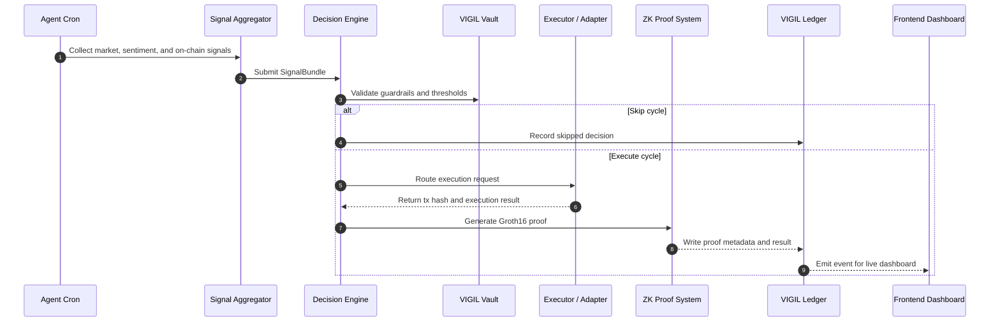

# VIGIL

VIGIL is an autonomous RWA portfolio agent built for Mantle. It watches market and sentiment data, scores opportunities, decides whether to act, executes rebalancing or yield routing when the confidence threshold is met, and records the outcome on-chain with proof-oriented logging.

The project is organized as a monorepo with four main parts:

1. `packages/agent` runs the decision loop, signal aggregation, execution logic, and proof generation.
2. `packages/contracts` contains the on-chain vault, ledger, registry, and adapter contracts.
3. `packages/indexer` listens for chain activity and mirrors events into a local database.
4. `packages/frontend` provides the landing page, dashboard, proof pages, and live operator views.

The short version is simple: VIGIL is meant to behave like a 24/7 portfolio operator that never sleeps. It reads the market, reasons over the data, acts only when the conditions are good enough, and leaves an auditable trail behind every decision.

## What The App Does

VIGIL is designed around one core idea: markets and information move continuously, but most humans do not. The app fills that gap by automating a portfolio workflow that spans data collection, scoring, execution, and verification.

It can:

1. Collect price, yield, flow, and sentiment signals from the supported data sources.
2. Evaluate those signals against a deterministic decision engine.
3. Decide whether to execute a trade, rebalance yield, route liquidity, or skip the cycle.
4. Execute the action through the appropriate adapter or bridge path.
5. Log the result for later inspection in the ledger, dashboard, and proof pages.

The system is intentionally conservative. It is not built to trade every minute. It is built to make repeatable, explainable decisions and only act when the signal stack justifies it.

## Big Picture

Here is the app as a complete system.

```text
		      +-----------------------------+
		      |         User / Judge        |
		      +--------------+--------------+
					|
					v
		      +--------------+--------------+
		      |        VIGIL Frontend       |
		      | Landing / Dashboard / Proof|
		      +--------------+--------------+
					|
		  live updates       | HTTP / WebSocket
					v
+-------------------+    signals    +-------------------+    execution    +-------------------+
|     Indexer       | <-----------> |   Decision Agent   | <------------> |  On-chain Vault   |
| event mirror      |               | score / choose     |                | ledger / registry |
+-------------------+               +---------+---------+                +---------+---------+
						     |                                     |
						     | proof + tx hash                     |
						     v                                     v
					    +-------------------+               +-------------------+
					    |   Proof System    |               |   External Rails  |
					    | Groth16 / Circom   |               | Fluxion / Bridge  |
					    +-------------------+               +-------------------+
```

## How It Works

The app follows a continuous loop.

```text
	   ┌────────────────────────────────────────────┐
	   │               Every 30 minutes             │
	   └────────────────────────────────────────────┘
				 |
				 v
		   +-------------------------+
		   | Collect signals         |
		   | Chainlink / Nansen /    |
		   | Elfa / on-chain state   |
		   +------------+------------+
				  |
				  v
		   +-------------------------+
		   | Aggregate and score     |
		   | into one decision model |
		   +------------+------------+
				  |
		  +-------------+-------------+
		  |                           |
		  v                           v
     +---------------------+      +----------------------+
     | Confidence too low? |      | Confidence strong?   |
     +----------+----------+      +----------+-----------+
		  |                            |
		  v                            v
	   +-----------+               +--------------+
	   |   Skip    |               |  Execute     |
	   +-----------+               +------+-------+
						    |
						    v
				      +------------------------+
				      | Prove and log outcome  |
				      +------------------------+
```

## Simple Sequence Diagram



## ASCII Art Walkthroughs

### 1) Landing to Dashboard

```text
+-------------------+        +-----------------------+        +----------------------+
|   Visitor opens   | -----> |  Landing page loads   | -----> |  "Enter Dashboard"  |
|   the app root    |        |  live agent status     |        |  button is pressed   |
+-------------------+        +-----------------------+        +----------------------+
									 |
									 v
								+----------------------+
								|  3D dashboard scene  |
								|  + live data panels  |
								+----------------------+
```

### 2) Decision Cycle

```text
   data feeds            reasoning             execution            proof

   +---------+         +-----------+         +-----------+        +----------+
   | Chainlink|         |           |         |           |        |          |
   +----+----+         |           |         |           |        |          |
	 |               |           |         |           |        |          |
   +----v----+     +----v----+      |   +-----v-----+    |   +----v-----+   |
   | Nansen  | --> | Signal  | ---> |-->| Executor  |--> |-->|   ZK      |-->
   +----+----+     | Bundle  |      |   | Adapter   |    |   |  Proof    |
	 |           +----+----+      |   +-----+-----+    |   +----+-----+   |
   +----v----+          |           |         |           |        |          |
   | Elfa AI | ---------+           |         |           |        |          |
   +---------+                      |         |           |        |          |
					   v         v           v        v
				      +--------------------------------------------+
				      |               Ledger / UI                  |
				      +--------------------------------------------+
```

### 3) What Happens on a Trade

```text
  [Signals arrive]
	  |
	  v
  [Decision engine scores opportunity]
	  |
	  v
  [Confidence clears threshold]
	  |
	  v
  [Guardrails pass]
	  |
	  v
  [Execution path selected]
	  |
	  v
  [Transaction sent]
	  |
	  v
  [Proof generated]
	  |
	  v
  [Ledger updated]
	  |
	  v
  [Frontend reflects result]
```

## Product Flow

The user experience is designed to feel like a live operations console rather than a static DeFi app.

1. Open the root page and read the live system state.
2. Click into the dashboard to enter the 3D operator view.
3. Watch the agent data, positions, and updates stream into the UI.
4. Open a proof page to inspect the result of a specific decision.
5. Use the repo scripts to run the agent, indexer, frontend, and contract tests locally.

That flow matters because VIGIL is not just a contract or a bot. It is a full product with presentation, automation, and auditability all tied together.

## User Instructions

### Prerequisites

You need:

1. Node.js 20 or newer.
2. `pnpm` installed globally.
3. A Mantle Sepolia RPC endpoint or the default public RPC from `.env.example`.
4. A configured `.env` file based on `.env.example`.
5. Access to the external API keys listed in `.env.example` if you want the full agent loop to run.

### Install

From the repository root:

```bash
pnpm install
```

### Configure Environment

Copy `.env.example` to `.env` and fill in the required values. The most important fields are:

1. `AGENT_PRIVATE_KEY`
2. `NANSEN_API_KEY`
3. `ELFA_API_KEY`
4. `WEB3_STORAGE_KEY`
5. `DATABASE_URL`
6. `NEXT_PUBLIC_WS_URL`

The sample file also includes the contract addresses, bridge settings, and token addresses used by the system.

### Run The Pieces

The root `package.json` exposes the main workspace commands:

```bash
pnpm contracts:test
pnpm contracts:deploy
pnpm agent:dev
pnpm agent:cron
pnpm indexer:dev
pnpm frontend:dev
pnpm frontend:build
```

Suggested startup order for local development:

1. Start the indexer so events can be mirrored into the local database.
2. Start the agent so the decision loop begins producing actions.
3. Start the frontend so the dashboard can read live updates.
4. Run contract tests or deployment scripts when you need to validate the on-chain layer.

### View The App

Once the frontend is running, open the local URL printed by Next.js. The root landing page shows the live system state and the dashboard exposes the deeper operational views.

### How To Use The App

The intended usage is straightforward:

1. Use the landing page as the public overview of the system.
2. Click into the dashboard for the operator view.
3. Monitor live decisions, execution status, and the running totals.
4. Open proof pages to inspect the chain hash and the generated evidence for a decision.
5. Treat the app as a live portfolio operations console, not a manual trading terminal.

## What Each Package Does

### `packages/agent`

This package contains the autonomous logic. It collects the inputs, scores them, chooses an action, sends the execution request, and prepares the proof and metadata trail.

### `packages/contracts`

This package contains the on-chain storage and validation layer. It is where the vault, ledger, registry, and adapters live.

### `packages/indexer`

This package listens to the chain and mirrors important events into a local SQLite database so the frontend can display them quickly.

### `packages/frontend`

This package contains the visible product. It is intentionally stylized as an operations console so users understand that the app is autonomous and live.

## Repository Structure

```text
vigil/
├── README.md
├── VIGIL_PRD.md
├── packages/
│   ├── agent/
│   ├── contracts/
│   ├── frontend/
│   └── indexer/
└── package.json
```

## Design Intent

VIGIL is built to communicate three things at once:

1. It is autonomous.
2. It is auditable.
3. It is designed for live use, not just a static demo.

That is why the UI is structured like a control room, the agent runs continuously, and the backend keeps a full trail of decisions and proofs.

## Notes For Demo Day

If you are presenting the project, the strongest narrative is to show the app live from landing page to dashboard, then open a proof page and tie the screen state back to the on-chain record. The value of VIGIL is not just that it can decide. It is that it can decide, act, prove, and explain itself in one continuous loop.