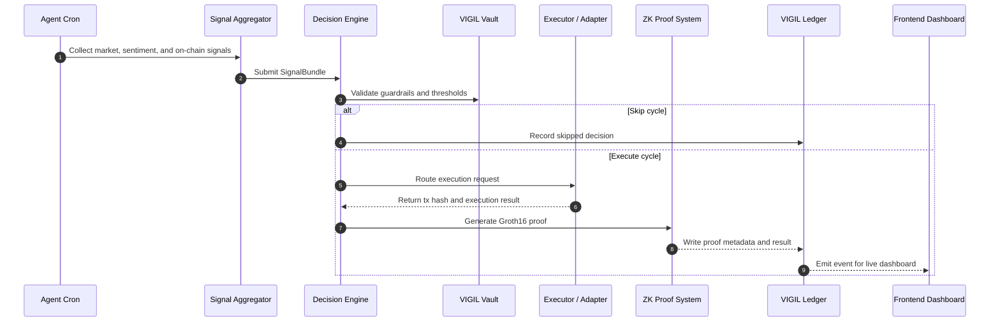

# VIGIL

VIGIL is an autonomous RWA portfolio agent built for Mantle. It watches market, yield, flow, and sentiment data, scores opportunities, decides whether to act, executes rebalancing or yield routing when the confidence threshold is met, and records the outcome on-chain with proof-oriented logging.

At a product level, VIGIL is a live portfolio operations console. It is not a passive dashboard and it is not a manual trading bot. It is a system that continuously observes market conditions, converts noisy inputs into a structured decision, and then explains the result back to the user through a visible interface and an on-chain trail.

The short version is simple: VIGIL behaves like a 24/7 portfolio operator that never sleeps. It reads the market, reasons over the data, acts only when the conditions are good enough, and leaves an auditable trail behind every decision.

## Product Overview

VIGIL is built for a specific user story: someone wants to manage a portfolio that spans tokenized equities, yield-bearing assets, and cross-chain opportunities without watching every market window manually.

The app turns that story into a repeatable workflow:

1. A data layer collects price, flow, and sentiment inputs.
2. A decision layer interprets those inputs and assigns confidence.
3. An execution layer routes the transaction through the right on-chain path.
4. A proof layer records what happened and why it happened.
5. A frontend layer presents the result in a readable, dramatic interface.

That combination is the core product idea. The value is not only the automation itself, but the fact that every action can be inspected after the fact.

## What The App Does

VIGIL is designed around one core idea: markets and information move continuously, but most humans do not. The app fills that gap by automating a portfolio workflow that spans data collection, scoring, execution, and verification.

It can:

1. Collect price, yield, flow, and sentiment signals from the supported data sources.
2. Evaluate those signals against a deterministic decision engine.
3. Decide whether to execute a trade, rebalance yield, route liquidity, or skip the cycle.
4. Execute the action through the appropriate adapter or bridge path.
5. Log the result for later inspection in the ledger, dashboard, and proof pages.

The system is intentionally conservative. It is not built to trade every minute. It is built to make repeatable, explainable decisions and only act when the signal stack justifies it.

## Repository Shape

The project is a monorepo with four main parts:

1. `packages/agent` runs the decision loop, signal aggregation, execution logic, and proof generation.
2. `packages/contracts` contains the on-chain vault, ledger, registry, and adapter contracts.
3. `packages/indexer` listens for chain activity and mirrors events into a local database.
4. `packages/frontend` provides the landing page, dashboard, charts, proof pages, and live operator views.

There is also a nested `vigil/` workspace in the repository. It contains a standalone Vite-based companion app and supporting visual assets that reinforce the storytelling and presentation side of the project.

## Screen Map

VIGIL’s frontend is built as a sequence of views that each answer a different question.

1. The landing page answers: “Is the agent alive and what is it doing right now?”
2. The dashboard answers: “What assets is the agent watching and how does the system move?”
3. The charts view answers: “How are the tracked assets behaving over time?”
4. The proof page answers: “What was decided, what was executed, and what was recorded?”

That structure matters because the UI is not trying to be a general-purpose exchange. It is trying to narrate one autonomous system from entry point to proof.

## Big Picture

Here is the app as a complete system.

```text
                      +-----------------------------+
                      |         User / Judge        |
                      +--------------+--------------+
                                     |
                                     v
                      +--------------+--------------+
                      |        VIGIL Frontend       |
                      | Landing / Dashboard / Proof |
                      +--------------+--------------+
                                     |
                  live updates       | HTTP / WebSocket
                                     v
 +-------------------+    signals    +-------------------+    execution    +-------------------+
 |      Indexer      | <-----------> |   Decision Agent   | <------------> |  On-chain Vault   |
 | event mirror      |               | score / choose     |                | ledger / registry |
 +-------------------+               +---------+---------+                +---------+---------+
                                                |                                     |
                                                | proof + tx hash                     |
                                                v                                     v
                                        +-------------------+               +-------------------+
                                        |   Proof System    |               |   External Rails  |
                                        | Groth16 / Circom  |               | Fluxion / Bridge  |
                                        +-------------------+               +-------------------+
```

## How It Works

The app follows a continuous loop.

```text
      ┌────────────────────────────────────────────┐
      │               Every 30 minutes             │
      └────────────────────────────────────────────┘
                            |
                            v
                +-------------------------+
                | Collect signals         |
                | Chainlink / Nansen /    |
                | Elfa / on-chain state   |
                +------------+------------+
                             |
                             v
                +-------------------------+
                | Aggregate and score     |
                | into one decision model |
                +------------+------------+
                             |
               +-------------+-------------+
               |                           |
               v                           v
    +---------------------+      +----------------------+
    | Confidence too low? |      | Confidence strong?   |
    +----------+----------+      +----------+-----------+
               |                            |
               v                            v
         +-----------+               +--------------+
         |   Skip    |               |  Execute     |
         +-----------+               +------+-------+
                                              |
                                              v
                                 +------------------------+
                                 | Prove and log outcome  |
                                 +------------------------+
```

## Simple Sequence Diagram



## Extended Flow Diagram

```text
  +------------------+
  | Wallet / Visitor |
  +--------+---------+
           |
           v
  +------------------+
  | Landing Page     |
  | agent status     |
  +--------+---------+
           |
           v
  +------------------+
  | Dashboard        |
  | live operator UI |
  +--------+---------+
           |
           v
  +------------------+
  | Charts           |
  | asset context    |
  +--------+---------+
           |
           v
  +------------------+
  | Proof Page       |
  | audit / history  |
  +--------+---------+
           |
           v
  +------------------+
  | On-chain trail   |
  | tx hash + proof  |
  +------------------+
```

## ASCII Art Walkthroughs

### 1) Landing to Dashboard

```text
+-------------------+        +-----------------------+        +----------------------+
|   Visitor opens   | -----> |  Landing page loads   | -----> |  Enter Dashboard    |
|    the app root   |        |  live agent status    |        |   button is pressed  |
+-------------------+        +-----------------------+        +----------------------+
                                                              |
                                                              v
                                                     +----------------------+
                                                     |  3D dashboard scene  |
                                                     |  + live data panels  |
                                                     +----------------------+
```

### 2) Decision Cycle

```text
   data feeds            reasoning             execution            proof

   +---------+         +-----------+         +-----------+        +----------+
   |Chainlink|         |           |         |           |        |          |
   +----+----+         |           |         |           |        |          |
        |               |           |         |           |        |          |
   +----v----+     +----v----+      |   +-----v-----+    |   +----v-----+   |
   | Nansen  | --> | Signal  | ---> |-->| Executor  |--> |-->|   ZK      |-->
   +----+----+     | Bundle  |      |   | Adapter   |    |   |  Proof    |
        |           +----+----+      |   +-----+-----+    |   +----+-----+   |
   +----v----+          |           |         |           |        |          |
   | Elfa AI | ---------+           |         |           |        |          |
   +---------+                      |         |           |        |          |
                                      v         v           v        v
                                 +--------------------------------------------+
                                 |               Ledger / UI                  |
                                 +--------------------------------------------+
```

### 3) What Happens on a Trade

```text
  [Signals arrive]
         |
         v
  [Decision engine scores opportunity]
         |
         v
  [Confidence clears threshold]
         |
         v
  [Guardrails pass]
         |
         v
  [Execution path selected]
         |
         v
  [Transaction sent]
         |
         v
  [Proof generated]
         |
         v
  [Ledger updated]
         |
         v
  [Frontend reflects result]
```

### 4) What Happens When The Agent Skips

```text
  [Signals arrive]
        |
        v
  [Confidence stays below threshold]
        |
        v
  [Guardrails are checked anyway]
        |
        v
  [Decision becomes SKIP]
        |
        v
  [Reason stored for audit]
        |
        v
  [Frontend updates counters]
```

### 5) What Happens When The User Opens A Proof

```text
  [User opens /proof or a tx-specific proof page]
        |
        v
  [Frontend requests ledger data]
        |
        v
  [Indexer returns stored entries]
        |
        v
  [UI expands reasoning and transaction metadata]
        |
        v
  [User inspects what happened and why]
```

## What The User Sees In Practice

The user experience is intentionally cinematic, but it is also functional.

1. The landing page shows a live agent status badge, a real-time ticker line, and summary statistics.
2. The dashboard opens into a richer operator view with data panels, movement, and a sense of scale.
3. The charts page gives asset-by-asset context for the instruments the agent monitors.
4. The proof page shows the on-chain record of actions and skips.
5. The whole interface is designed to make the agent feel active even before a trade is executed.

## Product Flow

The user experience is designed to feel like a live operations console rather than a static DeFi app.

1. Open the root page and read the live system state.
2. Click into the dashboard to enter the 3D operator view.
3. Watch the agent data, positions, and updates stream into the UI.
4. Open a proof page to inspect the result of a specific decision.
5. Use the repo scripts to run the agent, indexer, frontend, and contract tests locally.

### Typical Demo Narrative

If you are showing the app to someone for the first time, use this sequence:

1. Start on the landing page and point out the live agent feed and status counters.
2. Click through to the dashboard and explain the asset universe the agent is managing.
3. Open the charts page and show that the system is tracking the same instruments over time.
4. Open the proof page and demonstrate that the app keeps an audit trail.
5. Return to the landing page and emphasize that the system continues running without user input.

That flow matters because VIGIL is not just a contract or a bot. It is a full product with presentation, automation, and auditability all tied together.

## User Instructions

### Prerequisites

You need:

1. Node.js 20 or newer.
2. `pnpm` installed globally.
3. A Mantle Sepolia RPC endpoint or the default public RPC from `.env.example`.
4. A configured `.env` file based on `.env.example`.
5. Access to the external API keys listed in `.env.example` if you want the full agent loop to run.

### Install

From the repository root:

```bash
pnpm install
```

### Repository Layout

Before running the app, it helps to understand the workspace responsibilities:

1. `packages/agent` is the autonomous runtime.
2. `packages/contracts` is the on-chain state machine and verification layer.
3. `packages/indexer` is the data mirror used by the UI.
4. `packages/frontend` is the user interface.

If you only want to read the project story, start with `README.md` and `VIGIL_PRD.md`. If you want to work on the product, start with `packages/frontend` for the interface or `packages/agent` for the behavior.

### Configure Environment

Copy `.env.example` to `.env` and fill in the required values. The most important fields are:

1. `AGENT_PRIVATE_KEY`
2. `NANSEN_API_KEY`
3. `ELFA_API_KEY`
4. `WEB3_STORAGE_KEY`
5. `DATABASE_URL`
6. `NEXT_PUBLIC_WS_URL`

The sample file also includes the contract addresses, bridge settings, and token addresses used by the system.

### Run The Pieces

The root `package.json` exposes the main workspace commands:

```bash
pnpm contracts:test
pnpm contracts:deploy
pnpm agent:dev
pnpm agent:cron
pnpm indexer:dev
pnpm frontend:dev
pnpm frontend:build
```

### Recommended Development Order

The cleanest local workflow is:

1. Install dependencies.
2. Fill in `.env` from `.env.example`.
3. Run the contracts tests if you are validating the on-chain side.
4. Start the indexer so the UI has data to read.
5. Start the agent so the decision loop begins to emit events.
6. Start the frontend so the landing page, dashboard, charts, and proof pages can reflect the live system.

### How To Read The Output

When the system is running, look for these signals:

1. The landing page status line shows that the agent is active.
2. The dashboard stats show how many decisions have been made and executed.
3. The proof page shows whether the decision was a trade or a skip.
4. The ledger entries and tx hashes tell you where the on-chain record lives.
5. The chart pages show whether the agent is watching the right assets.

### View The App

Once the frontend is running, open the local URL printed by Next.js. The root landing page shows the live system state and the dashboard exposes the deeper operational views.

### How To Use The App

The intended usage is straightforward:

1. Use the landing page as the public overview of the system.
2. Click into the dashboard for the operator view.
3. Monitor live decisions, execution status, and the running totals.
4. Open proof pages to inspect the chain hash and the generated evidence for a decision.
5. Treat the app as a live portfolio operations console, not a manual trading terminal.

### What Each Main Page Is For

1. `/` is the public face of the project and the quickest way to tell whether the system is live.
2. `/dashboard` is the immersive operational view.
3. `/charts` is where asset context and relative movement are easiest to inspect.
4. `/proof` is the audit surface for decisions.

Those pages are deliberately different. The product should feel like one system that changes presentation based on the question being asked.

## What Each Package Does

### `packages/agent`

This package contains the autonomous logic. It collects the inputs, scores them, chooses an action, sends the execution request, and prepares the proof and metadata trail.

### `packages/contracts`

This package contains the on-chain storage and validation layer. It is where the vault, ledger, registry, and adapters live.

### `packages/indexer`

This package listens to the chain and mirrors important events into a local SQLite database so the frontend can display them quickly.

### `packages/frontend`

This package contains the visible product. It is intentionally stylized as an operations console so users understand that the app is autonomous and live.

## Asset and Decision Language

The app is organized around a small number of recurring concepts:

1. `SignalBundle` is the raw data collected from the outside world.
2. `Decision` is the scored outcome of the agent’s reasoning.
3. `Execution` is the actual on-chain or cross-chain action.
4. `Proof` is the evidence that explains the action afterward.

That flow is visible in both the code and the UI, which is why the app can be described as both automated and explainable.

## Design Intent

VIGIL is built to communicate three things at once:

1. It is autonomous.
2. It is auditable.
3. It is designed for live use, not just a static demo.

That is why the UI is structured like a control room, the agent runs continuously, and the backend keeps a full trail of decisions and proofs.

## Why The Project Is Structured This Way

The architecture is split across packages for a practical reason: each part of the system has a different job and a different failure mode.

1. The agent can change without changing the frontend copy.
2. The contracts can harden without rewriting the dashboard.
3. The indexer can evolve without changing the execution logic.
4. The frontend can improve presentation without changing the decision math.

That separation makes the app easier to understand, easier to debug, and easier to demo.

## Repository Structure

```text
vigil/
├── README.md
├── VIGIL_PRD.md
├── packages/
│   ├── agent/
│   ├── contracts/
│   ├── frontend/
│   └── indexer/
└── package.json
```

## Notes For Demo Day

If you are presenting the project, the strongest narrative is to show the app live from landing page to dashboard, then open a proof page and tie the screen state back to the on-chain record. The value of VIGIL is not just that it can decide. It is that it can decide, act, prove, and explain itself in one continuous loop.

## Final Mental Model

If you need one sentence to remember the product, use this:

> VIGIL is an autonomous portfolio operator for Mantle that watches the market, decides when to act, executes safely, and leaves a readable proof trail behind every move.